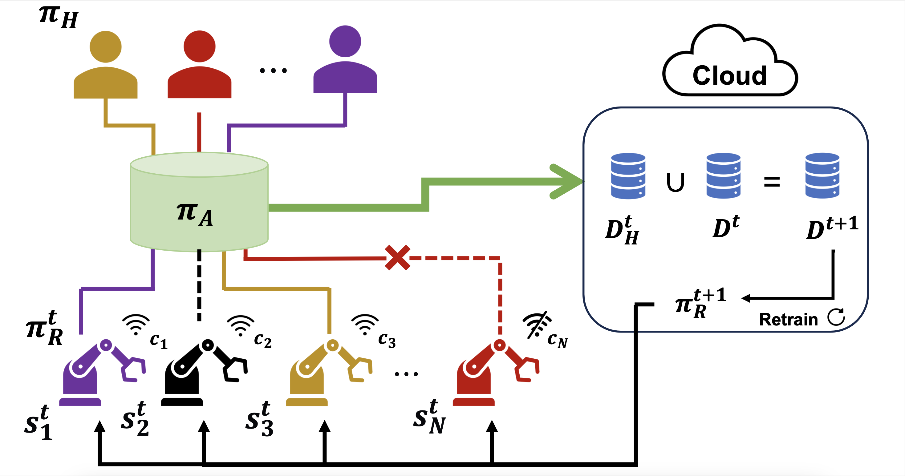
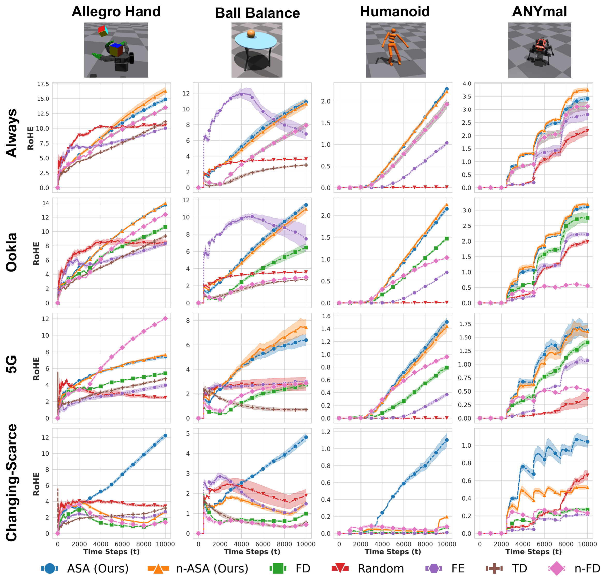

# Fleet Supervisor Allocation: A Submodular Maximization Approach

This repository contains the code for the paper "[Fleet Supervisor Allocation: A Submodular Maximization Approach](https://openreview.net/forum?id=9dsBQhoqVr)" presented at CoRL 2024. This work introduces an adaptive allocation policy for robotic fleets to maximize data collection efficiency while accommodating uncertain connectivity.

This repository builds upon concepts from the [Interactive Fleet Learning Benchmark](https://github.com/BerkeleyAutomation/ifl_benchmark) repository, extending it to accommodate operational uncertainties in allocation policies.

## Table of Contents
- [Abstract](#abstract)
- [System Overview](#system-overview)
- [Experimental Results](#experimental-results)
- [Installation](#installation)
  - [Requirements](#requirements)
  - [Setup](#setup)
- [How to Run](#how-to-run)
- [Citation](#citation)

## Abstract

<details>
<summary>Click to expand</summary>
In real-world scenarios, the data collected by robots in diverse and unpredictable environments is crucial for enhancing their models and policies. This data is predominantly collected under human supervision, particularly through imitation learning (IL), where robots learn complex tasks by observing human supervisors. However, the deployment of multiple robots and supervisors to accelerate the learning process often leads to data redundancy and inefficiencies, especially as the scale of robot fleets increases. Moreover, the reliance on teleoperation for supervision introduces additional challenges due to potential network connectivity issues. 
To address these inefficiencies and the reliability concerns of network-dependent supervision, we introduce an Adaptive Submodular Allocation policy, ASA, designed for efficient human supervision allocation within multi-robot systems under uncertain connectivity. Our approach reduces data redundancy by balancing the informativeness and diversity of data collection, and is capable of accommodating connectivity variances. We evaluated the effectiveness of ASA in simulation environments with 100 robots across four different environments and various network settings, including a real-world teleoperation scenario over a 5G network. We trained and tested both our and the state-of-the-art policies utilizing NVIDIA's Isaac Gym, and our results show that ASA enhances the return on human effort by up to 5.95×, outperforming current baselines in all simulated scenarios and providing robustness against connectivity disruptions.

</details>

## System Overview

**Supervisor Allocation Problem:** At each time step $t$, the human supervisors with policy $\pi_{H}$ are allocated to the robots with policy $\pi_{R}^t$ based on the allocation policy $\pi_{A}$. Each robot $i$ operates in a different state $s_i^t$, and the human supervisors are allocated to the robots based on the uncertainty of the robots and the similarity between the robots. Additionally, the supervision is provided through teleoperation with probability $c_i$, meaning there is a chance that the connection to robot $i$ might fail. At the end of each time step $t$, the data collected by human supervisors $D_H^t$ is added to the dataset $D^t$ to create an updated dataset $D^{t+1}$, which is then used to train the robot policy $\pi_R^{t+1}$. 

## Experimental Results


**Experimental Results:** Here, each row represents a different network configuration and each column corresponds to a different environment. The performance is measured by Return on Human Effort (RoHE). Our ASA and n-ASA policies is affected least by changes in the network configurations due to their stochastic submodular maximization-based policies that can incorporate network uncertainties. The submodular maximization objective improves the performance when there are no network uncertainties due to its ability to cover diverse and informative scenarios. Additionally, ASA outperforms n-ASA in the Changing-Scarce network configuration thanks to its adaptive nature to network connectivity changes. 


## Installation

### Requirements
- Python 3.9.7
- Conda for managing dependencies
- NVIDIA Isaac Gym 1.0rc4: Download from [NVIDIA Isaac Gym](https://developer.nvidia.com/isaac-gym) and place it under the `isaacgym` directory.

### Setup

1. Clone the repository, then initialize the submodules if needed:
    ```bash
    git submodule update --init
    ```

2. Create a Conda environment for the project:
    ```bash
    conda env create -f environment.yml
    conda activate fsa
    ```

3. Install Isaac Gym and IsaacGymEnvs:
    ```bash
    cd isaacgym/python
    pip install -e .
    cd ../../IsaacGymEnvs
    pip install -e .
    ```

## How to Run

### Running Allocation Policies
Run the allocation policies for different environments using the provided scripts. To change the network configuration, modify the `network_type` variable in the respective `run_[ENV_NAME].sh` file.

- **Humanoid**: 
  ```bash
  . scripts/run_humanoid.sh
  ```
- **Allegro Hand**:
  ```bash
  . scripts/run_allegro.sh
  ```
- **ANYmal**:
  ```bash
  . scripts/run_anymal.sh
  ```
- **Ball Balance**:
  ```bash
  . scripts/run_ballbalance.sh
  ```

### Generating Plots
All experiment logs are saved under `logs/`. Each task has a dedicated directory (e.g., `logs/humanoid`). To generate plots from experiment logs, run:
```bash
python plotting/plot.py logs/humanoid [METRIC]
```
Where `[METRIC]` can be `ROHE`, `cumulative_success`, or other defined metrics.

## Citation

If you use this code in your research, please cite our paper:
```
@inproceedings{
akcin2024fleet,
title={Fleet Supervisor Allocation: A Submodular Maximization Approach},
author={Oguzhan Akcin and Ahmet Ege Tanriverdi and Kaan Kale and Sandeep P. Chinchali},
booktitle={8th Annual Conference on Robot Learning},
year={2024},
url={https://openreview.net/forum?id=9dsBQhoqVr}
}
```